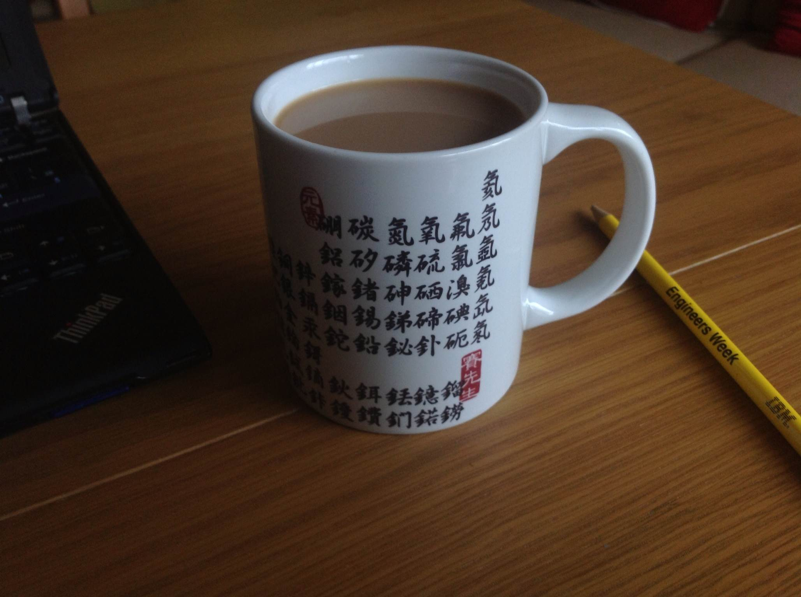
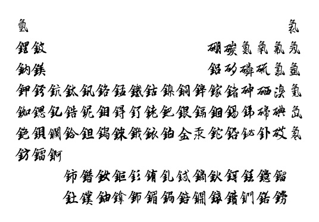

# About the "cup poem"

in 2013, I got this cup for my birthday:

from a Taiwan company called Mr. Sai 賽先生

I think this is my cup, in "running style" script, though it has been updated with some of the more recently discovered elements and a slightly different design:
https://www.mr-sai.com/products/running-script-periodic-table-mug

There's also a Seal script version of the cup:
https://www.mr-sai.com/products/seal-script-periodic-table-mug

this looks like a knock-off
https://www.cafepress.com/mf/7561155/periodic-table-in-traditional-_mugs?productId=23827866

nice-looking in a more traditional cup, with some nice non-Chinese table of the elements variations
https://twitter.com/cenmag/status/1097515031820931072

## Beagle Talk

This is where I prepare my Beagle talk on the Chinese Periodic Table.

As a near-lifelong student of Chinese, some time ago I decided to switch from cursing Chinese characters to praising them.

I went through 3 overlapping phases:

1. Woah, Chinese characters, so cool-looking
2. This has got to be the dumbest writing system
3. Maybe this is better than the alphabet

If you read between the lines, a lot of this is WHY CAN'T I LEARN THIS?!

## Miscellaneous

This looks worth reading:
https://en.wikipedia.org/wiki/Chemical_elements_in_East_Asian_languages

this web site is good at converting to calligraphy
http://www.akuziti.com/mb/

It helped me make this low-res generated calligraphy:

